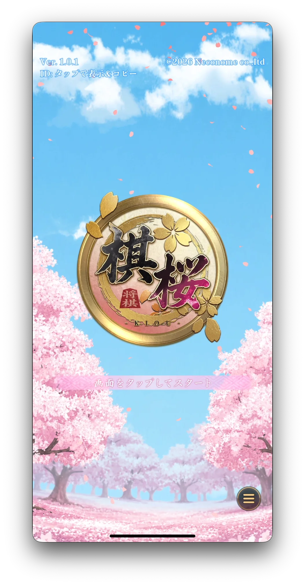
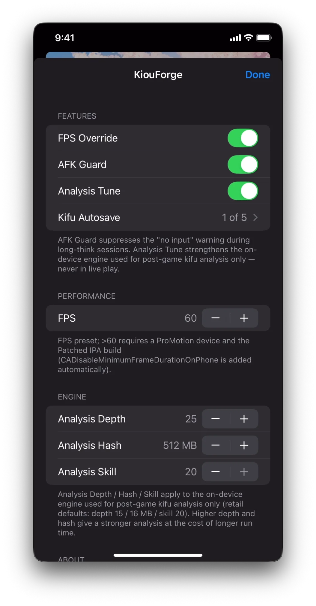
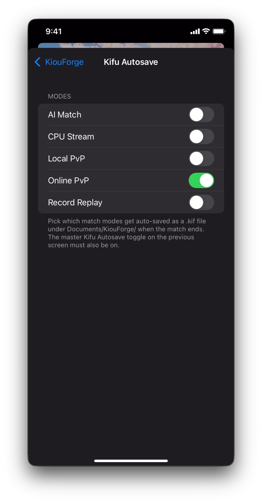

<h1 align="center">KiouForge</h1>

<p align="center">
  
</p>

<p align="center">
  <em>棋桜（KIOU）向けのローカル快適化拡張。<br/>
  フレームレート調整・AFK警告の抑制・棋譜の自動保存・<br/>
  対局後の棋譜解析エンジン強化 — すべてデバイス内で完結、サーバーへの影響ゼロ。</em>
</p>

<p align="center">
  
  
  
  
  
  
</p>

---

**棋桜（KIOU）** は株式会社ネコノメによるオンライン将棋対戦アプリです。
[App Store](https://apps.apple.com/jp/app/%E6%A3%8B%E6%A1%9C/id6755948307) からダウンロードできます。

KiouForge は KIOU の快適化拡張ツールで、公式クライアントでは設定できない項目を解放します — フレームレートプリセット、AFK警告の抑制、対局後の棋譜解析チューニング、棋譜の自動保存。すべての変更はデバイス内で完結し、サーバーへの通信や対局中の動作には一切影響しません。

<p align="center">
  
  
  
  
</p>

## 機能一覧

| 機能 | 内容 |
|---|---|
| **FPS Override** | フレームレートのプリセットを `{15, 24, 30, 45, 60, 90, 120}` fps に拡張します。60fps超には ProMotion 対応デバイスが必要です。詳細は[パフォーマンス](#パフォーマンス)を参照してください。 |
| **AFK Guard** | 「入力なし」警告と、それに続く自動投了を抑制します。公式のタイマーは無入力から約60秒で発動します。長考や検討中の誤発動防止に有効です。 |
| **Analysis Tune** | デバイス内蔵の Rshogi NNUE エンジンが**対局後の棋譜解析**で使用する探索深度・ハッシュ・強さのパラメータを引き上げます。対局中には一切影響しません。 |
| **Kifu Autosave** | 対局終了時に `.kif` ファイルを `Documents/KiouForge/` へ自動保存します。ファイル名にはタイムスタンプ・モード・対局者名（日本語そのまま）・開始局面が含まれます。AI・CPU配信・ローカル対局・オンライン対局・棋譜再生の各モード別にオン/オフを切り替えられます（初期値はすべてオン）。 |
| **アカウント切り替え** | 複数の KIOU アカウントを保存し、再インストールなしに切り替えられます。アカウントはログイン時に自動記録されます。設定画面の **Account → Active** で一覧を確認し、行をタップして切り替え（アプリが自動でタイトル画面に遷移）。**New Register** を使うと KIOU のリセットボタンを経由せずに新規アカウントを作成できます。 |

## パフォーマンス

フレームレートのステッパーは `{15, 24, 30, 45, 60, 90, 120}` を順に切り替えます。
初期値は **60**（公式の値）のため、インストール直後は何も変わりません。

| プリセット | 用途 |
|---|---|
| 15 / 24 | バッテリー節約重視 |
| 30 | 低電力（公式最低値） |
| 45 | バランス |
| 60 | 公式デフォルト |
| 90 / 120 | ProMotion 対応デバイス限定（iPhone 13 Pro以降 / iPad Pro M1以降） |

60fps超を実現するには：
1. ProMotion 対応デバイスであること。
2. Patched IPA ビルドを使用すること（Chinlan パイプラインが `CADisableMinimumFrameDurationOnPhone = true` を Info.plist に自動追加します）。

## 解析エンジン

棋譜詳細画面の「解析」ボタンは、デバイス内蔵の **Rshogi NNUE エンジン**（`NativeSyncSession`）をローカルで実行します。KIOU の初期設定は控えめな値になっています：

| パラメータ | 初期値 | 設定範囲 |
|---|---|---|
| `Analysis Depth`（探索深度） | 15 | 1 〜 36 |
| `Analysis Hash`（ハッシュサイズ） | 16 MB | 16 / 64 / 128 / 256 / 512 / 1024 MB |
| `Analysis Skill`（強さ） | 20（最大） | 1 〜 20 |

深度とハッシュを上げると解析精度が上がる代わりに時間がかかります。強さ20がすでに最大値で、それより低い値はエンジンを意図的に弱くします。

これらのパラメータは**対局後の検討画面にのみ適用**されます。対局中はエンジンの組み込み設定がそのまま使われるため、Analysis Tune は対局中のAIサポートや指し手表示には影響しません。

## 棋譜自動保存

対局が終了すると、KiouForge はアプリのサンドボックス内の `Documents/KiouForge/` に標準的な KIF 2.0 ファイルを書き出します（Files アプリや Filza から参照できます）。

**ファイル名の形式：**

```
{タイムスタンプ}_{モード}_{先手}vs{後手}_{開始局面}.kif
```

| セグメント | 例 | 備考 |
|---|---|---|
| `タイムスタンプ` | `20260614T234500` | UTC、ISO 8601 基本形式 |
| `モード` | `OnlinePvPMode` | 機能一覧のモード名を参照 |
| `先手` / `後手` | `田中太郎vs佐藤花子` | プレイヤー名をそのまま使用。`/` と制御文字のみ除去 |
| `開始局面` | `startpos` | 平手は `startpos`、駒落ちは `sfen-<8桁の16進数>`、取得できない場合は `unknown` |

**ファイルの内容：**

PiyoShogi・将棋ブラウザQ・KifuCloud など主要な棋譜ビューアに対応した標準 KIF 2.0 形式（UTF-8、BOMなし）。対局者名・開始日時・持ち時間・終局理由を含みます（取得できた項目のみ）。

## 設定画面

画面右端からスワイプすると設定シートが開きます。4つのセクションがあります：
- **Features** — 上記機能一覧の各トグル。**Kifu Autosave** の行をタップするとモード別トグルのサブ画面に遷移します。マスタートグルとモード別トグルの両方がオンのときだけ自動保存が動作します。
- **Performance** — フレームレートのステッパー。
- **Engine** — Analysis Depth / Analysis Hash / Analysis Skill のステッパー。
- **About** — リポジトリリンク、作者の X アカウント、ビルドコミット。

すべての設定値は再起動後も保持されます。

## アカウント切り替え

KiouForge はログインパスにフックを挿入し、`LoginAsync` を通過したすべてのアカウントを自動的に `NSUserDefaults` に保存します。リストはアプリのアップデート後も保持されます。

**動作の仕組み：**

1. インストール後の初回起動時に、`UserSaveDataExtensions.AccountExists` から現在ログイン中のアカウントを取得します。
2. ログインが成功するたびに `RunLoginSequenceAsync.MoveNext` が `LoginReply`（deviceId・userName・JWT.sub から取得した userId）を記録します。
3. 設定画面 → **Account → Active** で保存済みアカウントを確認し、行をタップして切り替えます。KiouForge は `pending_device_id` の置き換えを予約し、次回の `LoginArgs.Create` 呼び出し時に `deviceId` 引数をサイレントに差し替えてサーバーから目的のアカウントのセッションを取得します。
4. **New Register** は新しい UUID を予約してログインフローを名前入力画面に誘導します — KIOU のリセットボタンを使わずに新規アカウントを作成できます（リセットは既存アカウントの UUID の再バインドを引き起こす場合があります）。

切り替え時に `distinctId`（TDAnalytics キーチェーン UUID）は**意図的に変更しません** — 変更すると `-40004` 認証エラーが発生します。

## 対応環境

| | |
|---|---|
| **対応 KIOU バージョン** | `1.0.1`（CFBundleVersion 11）および `1.0.2`（CFBundleVersion 12） |
| **KIOU の最低 iOS バージョン** | 10.0（アプリの `MinimumOSVersion`） |
| **KiouForge の最低 iOS バージョン** | 13.0（`UIWindowScene` が必要） |
| **動作確認済み** | 15.0 〜 26、arm64 |
| **配布形式** | JB rootless `.deb`、TrollStore 向け jailed `.dylib`、Patched IPA（Sideloadly / AltStore） |

フックサイトはビルドごとにアドレスが固定されています。特定バージョンを対象にするには `make ipa TARGET_VERSION=<ver>` を使います。

## ビルド

### Jailbreak デバイス（rootless）

`make package install` は SSH 経由で `.deb` を転送してインストールします。
デバイス側に `openssh-server`（Sileo/Zebra からインストール）、ホスト側に `ssh` が必要です。

```sh
make package
make package install THEOS_DEVICE_IP=<device-ip>
```

### Jailed dylib（TrollStore）

TrollStore は特定の iOS バージョンにのみ対応しています。事前に
[対応バージョン一覧](https://ios.cfw.guide/installing-trollstore/)を確認してください。

```sh
make jailed
# -> packages/jailed/KiouForge.dylib
```

復号済みの KIOU `.app/Frameworks/` 内に配置し、`LC_LOAD_DYLIB` を追加してから TrollStore でインストールします。

### Patched IPA（サイドロード）

TrollStore が使えないデバイス向けです。[Sideloadly](https://sideloadly.io/) または [AltStore](https://altstore.io/) でインストールします。

**復号済み** の KIOU IPA が必要です（[palera1n](https://palera.in/) + Filza または [TrollDecrypt](https://github.com/donato-fiore/TrollDecrypt) で取得できます）。App Store からダウンロードした IPA は FairPlay で暗号化されているため、そのままでは使用できません。

```sh
# デフォルト（1.0.2）
mkdir -p assets/1.0.2
cp ~/Downloads/Kiou-1.0.2.ipa assets/1.0.2/
make ipa
# -> packages/ipa/KiouForge-patched.ipa

# バージョンを指定する場合
make ipa TARGET_VERSION=1.0.1
```

フックサイトを編集した後や KIOU のアップデート後にビルドする場合：

```sh
# 特定バージョンの dump + IPA でレシピを検証
PYTHONPATH=shared:. TARGET_VERSION=1.0.2 python3 -m tools.verify_sites \
  --recipe recipes \
  --index  assets/1.0.2/dump.cs.index.json \
  --ipa    assets/1.0.2/Kiou-1.0.2.ipa
```
